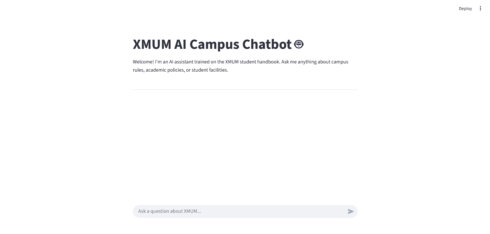

# RAG Campus Chatbot

A Retrieval-Augmented Generation (RAG) system for campus information queries, implementing state-of-the-art sentence-window retrieval for improved accuracy and context quality.



## Features

### Advanced RAG Pipeline
- **Sentence-Window Retrieval**: Precise retrieval with context-aware windows
- **Hybrid Search**: BM25 + vector similarity with Reciprocal Rank Fusion (RRF) + cross-encoder reranking
- **Enhanced OCR**: Advanced document processing for image-based PDFs
- **Table-Aware Extraction**: Preserves fee structures and tabular data relationships
- **Semantic Caching**: Query result caching with similarity-based retrieval
- **Centralized Configuration**: Pydantic-validated settings with fail-fast startup
- **Structured Logging**: JSON logging with request ID tracing

### Enhanced User Experience (NEW)
- **Conversation Memory**: Session-based context for follow-up questions
- **Multi-Part Question Handling**: Detects and addresses "What are fees AND deadlines?" queries
- **Ambiguous Query Detection**: Prompts for clarification when needed
- **Citation Verification**: Filters and validates retrieved chunks
- **Confidence Scoring**: Shows response reliability to users
- **Improved Prompts**: Context-aware prompting with system messages

### Architecture
- **Microservices**: FastAPI backend, Streamlit frontend, Celery workers, Redis, ChromaDB
- **Async Processing**: Background document ingestion with Redis-backed task queue
- **Optimized Dependencies**: Component-specific requirements for smaller builds
- **Docker Ready**: Full containerization with dev/prod configurations

### Quality & Monitoring  
- **RAGAs Evaluation**: Faithfulness, relevancy, recall, and precision metrics
- **Performance Gates**: Quality thresholds for CI/CD integration
- **Error Handling**: Granular HTTP status codes (503 for LLM issues, 500 for DB errors)
- **Health Checks**: Container health monitoring with automatic restarts

---

## Quick Start

All commands are available via **Make** for consistency across platforms:

```bash
make help         # See all available commands
```

### Docker (Recommended)

```bash
# 1. Configure environment
cp .env.example .env
# Edit .env and add your GROQ_API_KEY

# 2. Start all services
make up

# 3. Ingest documents
make ingest

# 4. Access services
# Frontend: http://localhost:8501
# Backend API: http://localhost:8000/docs
```

### Local Development

```bash
# 1. Setup development environment
make dev

# 2. Configure environment  
cp .env.example .env
# Edit .env and add your GROQ_API_KEY

# 3. Start Redis (separate terminal)
redis-server

# 4. Start services
make api          # Terminal 1: API server
make worker       # Terminal 2: Celery worker
make ui           # Terminal 3: Streamlit UI
```

### Common Commands

```bash
make up           # Start Docker services
make down         # Stop Docker services
make ingest       # Ingest documents from data/
make test         # Run all tests
make test-arch    # Run architecture tests
make lint         # Run linters
make logs         # View Docker logs
```

### Add Documents

```bash
# Add your documents to the data/ folder
cp your_documents.pdf data/

# Ingest documents
make ingest

# Or ingest specific file
make ingest-file FILE=data/handbook.pdf
```

**For detailed setup instructions, see [docs/DEVELOPMENT.md](docs/DEVELOPMENT.md)**

### Access Applications

| Service | URL |
|---------|-----|
| Frontend UI | http://localhost:8501 |
| Backend API | http://localhost:8000/docs |
| Health Check | http://localhost:8000/ |

---

## Architecture

### Overview

```
┌─────────────┐         ┌──────────────┐
│   Browser   │────────▶│  Streamlit   │
│             │         │   UI:8501    │
└─────────────┘         └──────┬───────┘
                               │
                               ▼
┌─────────────┐         ┌──────────────┐         ┌──────────────┐
│   Trigger   │────────▶│  FastAPI     │────────▶│   ChromaDB   │
│  Ingestion  │         │  Server:8000 │         │ Vector Store │
└──────┬──────┘         └──────────────┘         └──────────────┘
       │                       ▲
       │                       │
       ▼                       │
┌─────────────┐         ┌──────────────┐
│    Redis    │────────▶│    Celery    │
│   Broker    │         │    Worker    │
└─────────────┘         └──────────────┘
```

### Components

1. **API Server (`main.py`)**: Stateless FastAPI server handling queries
2. **Celery Worker (`ingestion_worker.py`)**: Async document processing
3. **RAG Pipeline (`rag_pipeline.py`)**: Core retrieval and generation logic
4. **Enhanced RAG Engine (`enhanced_rag_engine.py`)**: Query analysis, conversation memory, citation verification
5. **Table-Aware Loader (`table_aware_loader.py`)**: Specialized PDF table extraction
6. **Sentence-Window Retrieval (`sentence_window_retrieval.py`)**: Chunking
7. **Streamlit UI (`app.py`)**: User interface with session support
8. **ChromaDB**: Vector database for embeddings
9. **Redis**: Message broker for Celery tasks

**Note**: The FastAPI server serves both `/ask` (basic) and `/ask/enhanced` (with conversation memory) endpoints. Document ingestion is handled via `make ingest` which auto-detects tables in PDFs.

---

## Project Structure

```
rag-campus-chatbot/
├── Makefile                      # Development commands (start here)
├── src/                          # Core application code
│   ├── main.py                   # FastAPI server + API endpoints
│   ├── app.py                    # Streamlit UI with session support
│   ├── config.py                 # Centralized configuration (Pydantic)
│   ├── logging_config.py         # Structured logging with JSON output
│   ├── rag_pipeline.py           # RAG pipeline + hybrid search
│   ├── enhanced_rag_engine.py    # Query analysis, conversation memory, citations
│   ├── ingestion_worker.py       # Celery worker for ingestion
│   ├── celery_config.py          # Celery configuration
│   ├── sentence_window_retrieval.py  # Sentence-window chunking
│   ├── enhanced_document_loader.py   # OCR document loader
│   └── table_aware_loader.py     # Table extraction for PDFs
├── scripts/                      # Utility scripts
│   ├── smart_ingest.py           # Smart ingestion with auto table detection
│   ├── direct_ingest.py          # Basic ingestion (no table detection)
│   ├── evaluate.py               # RAGAs evaluation
│   ├── trigger_ingestion.py      # Celery-based ingestion
│   ├── test_enhanced_features.py # Test enhanced RAG features
│   ├── check_task_status.py      # Task monitoring
│   ├── check_metrics.py          # Performance gating
│   └── shell/                    # Shell scripts
├── tests/                        # Test suite
│   ├── test_architecture.py      # Architecture validation tests
│   ├── test_system_evaluation.py # System evaluation tests
│   ├── eval_dataset.json         # Evaluation dataset
│   └── ...
├── docs/                         # Documentation
│   ├── DEVELOPMENT.md            # Development guide
│   └── UI.png                    # UI screenshot
├── requirements/                 # Split requirements
│   ├── base.txt                  # Common dependencies
│   ├── api.txt                   # FastAPI service
│   ├── worker.txt                # Celery worker
│   ├── ui.txt                    # Streamlit UI
│   └── dev.txt                   # Development tools
├── data/                         # Document storage (gitignored)
├── .env.example                  # Environment variables template
├── .gitignore                    # Git ignore rules
├── docker-compose.yml            # Production Docker config
├── docker-compose.dev.yml        # Development Docker config
├── Dockerfile.api                # API container
├── Dockerfile.worker             # Worker container
├── Dockerfile.ui                 # UI container
├── Dockerfile.backend.dev        # Development backend
├── Dockerfile.frontend.dev       # Development frontend
├── Dockerfile.worker.dev         # Development worker
└── README.md                     # This file
```

---

## Document Ingestion

### How Ingestion Works

Documents are **NOT automatically ingested** when you start the system. You must manually trigger ingestion after:
1. First-time setup
2. Adding new documents to the `data/` folder
3. Updating existing documents

### Ingestion Methods

| Command | Description | Use Case |
|---------|-------------|----------|
| `make ingest` | Smart ingestion (auto-detects tables) | All documents including PDFs with tables |
| `make ingest-basic` | Basic ingestion without table detection | Faster, for simple text documents |
| `make ingest-celery` | Async via Celery worker | Production/Docker environment |

### Recommended Workflow

```bash
# 1. Add documents to data/ folder
cp your_documents.pdf data/

# 2. Run smart ingestion (auto-detects tables)
make ingest

# 3. Verify ingestion
make ingest-stats
```

### Incremental Updates

The system supports document versioning. When you re-run ingestion:
- Only changed/new files are processed (with `--use-versioning`)
- Deleted files are tracked
- Use `make ingest-clear` to start fresh

---

## API Endpoints

### Query Endpoints

| Endpoint | Method | Description |
|----------|--------|-------------|
| `/ask` | POST | Basic question answering |
| `/ask/enhanced` | POST | Enhanced with conversation memory, multi-part handling |
| `/analyze` | POST | Analyze query without generating response |

### Session Endpoints

| Endpoint | Method | Description |
|----------|--------|-------------|
| `/session/{id}` | GET | Get session info (history, topics, entities) |
| `/session/{id}` | DELETE | Clear session history |

### Example: Enhanced Query with Session

```bash
# First question
curl -X POST http://localhost:8000/ask/enhanced \
  -H "Content-Type: application/json" \
  -d '{"query": "What is the tuition fee for Data Science?", "session_id": "my-session"}'

# Follow-up question (uses conversation context)
curl -X POST http://localhost:8000/ask/enhanced \
  -H "Content-Type: application/json" \
  -d '{"query": "What about for international students?", "session_id": "my-session"}'
```

---

## Sentence-Window Retrieval

### How It Works

Traditional chunking splits documents into fixed-size blocks, often breaking semantic meaning. Sentence-window retrieval solves this:

1. **Split by sentences**: Use NLTK to identify sentence boundaries
2. **Create windows**: Each chunk contains a central sentence + N surrounding sentences
3. **Embed central sentence**: Store only the central sentence's embedding
4. **Return full window**: LLM receives complete context for better generation

### Benefits

- 10-15% better retrieval accuracy
- Precise semantic matching
- Rich context for generation
- Respects document structure

### Example

```
Document: "The cafeteria opens at 7 AM. Breakfast is served until 10 AM. Lunch starts at 11:30 AM."

Window 1:
  Central: "The cafeteria opens at 7 AM."
  Context: "The cafeteria opens at 7 AM. Breakfast is served until 10 AM."

Window 2:
  Central: "Breakfast is served until 10 AM."
  Context: "The cafeteria opens at 7 AM. Breakfast is served until 10 AM. Lunch starts at 11:30 AM."

Window 3:
  Central: "Lunch starts at 11:30 AM."
  Context: "Breakfast is served until 10 AM. Lunch starts at 11:30 AM."
```

When user asks "What time is breakfast?", the system:
1. Embeds the query
2. Finds central sentence "Breakfast is served until 10 AM"
3. Returns full window with surrounding context
4. LLM generates accurate answer

---

## Evaluation

The system uses [RAGAs](https://github.com/explodinggradients/ragas) framework to measure:

- **Context Precision**: Are retrieved chunks relevant?
- **Context Recall**: Did we find all relevant information?
- **Faithfulness**: Is the answer grounded in retrieved context?
- **Answer Relevancy**: Does the answer address the question?

```bash
# Run evaluation
python scripts/evaluate.py

# Check if metrics pass thresholds
python scripts/check_metrics.py
```

---

## Docker Deployment

```bash
# Build and start all services
make up
# or: docker compose up -d

# Check logs
make logs
# or: docker compose logs -f

# Ingest documents
make ingest

# Stop services
make down
# or: docker compose down
```

Services (from `docker-compose.yml`):
- **api**: FastAPI server (port 8000)
- **worker**: Celery worker
- **ui**: Streamlit UI (port 8501)
- **redis**: Message broker (port 6379)
- **chroma**: Vector database (port 8001)

---

## CI/CD Pipeline

The project includes a comprehensive MLOps pipeline (`.github/workflows/mlops-pipeline.yml`) that runs on every push and pull request.

### Pipeline Stages

1. **Code Quality**: Linting with flake8, black, and isort
2. **Unit Tests**: Run pytest on all test files
3. **RAG Evaluation**: Execute RAGAs metrics and enforce quality gates
4. **Docker Build**: Build and push images to GitHub Container Registry
5. **Integration Tests**: End-to-end tests with Docker Compose
6. **Security Scan**: Trivy vulnerability scanning
7. **Deployment Ready**: Final validation before deployment

### Setup GitHub Actions

**Required Secret:**
```bash
# In your GitHub repository:
# Settings → Secrets and variables → Actions → New repository secret

Name: GROQ_API_KEY
Value: your_groq_api_key_here
```

**Optional: Enable GitHub Container Registry (for image publishing)**

By default, images are **built but not pushed** to avoid permission errors.

To enable image publishing:
1. Go to your repository Settings → Actions → General
2. Scroll to "Workflow permissions"
3. Select "Read and write permissions"
4. Check "Allow GitHub Actions to create and approve pull requests"
5. Save changes

Then update `.github/workflows/mlops-pipeline.yml`:
```yaml
# Change line 247 from:
push: false
# To:
push: ${{ github.event_name == 'push' && github.ref == 'refs/heads/main' }}
```

This will push images only on main branch commits.

### Quality Gates

The pipeline enforces these minimum thresholds (defined in `scripts/check_metrics.py`):
- **Context Precision**: ≥ 0.70
- **Context Recall**: ≥ 0.70
- **Faithfulness**: ≥ 0.70
- **Answer Relevancy**: ≥ 0.70

If any metric falls below the threshold, the pipeline fails and prevents deployment.

### Viewing Results

- **Evaluation Results**: Download from workflow artifacts (retained 30 days)
- **Docker Images**: Available at `ghcr.io/<your-username>/rag-campus-chatbot-{api,worker,ui}`
- **Security Scans**: View in Security → Code scanning alerts

### Manual Trigger

You can manually trigger the pipeline:
```bash
# Go to Actions tab → MLOps Pipeline → Run workflow
```

---

### Configuration

### Requirements Structure

The project uses split requirements for optimized builds:
- **base.txt**: Core shared dependencies.
- **api.txt**: FastAPI + LLM + vector database dependencies.
- **worker.txt**: Celery worker, OCR, document processing, and retrieval stack.
- **ui.txt**: Streamlit UI and HTTP client.
- **dev.txt**: Worker stack plus evaluation and development tools.

### Environment Variables (`.env`)

```bash
# Required
GROQ_API_KEY=your_groq_api_key_here

# Optional (defaults shown)
CHROMA_DB_PATH=./chroma_db
COLLECTION_NAME=collection
REDIS_HOST=localhost
REDIS_PORT=6379
REDIS_DB=0
API_BASE_URL=http://127.0.0.1:8000
```

### Model Configuration

All models are configured in `src/config.py` via environment variables or defaults:

| Component | Model | Dimension |
|-----------|-------|----------|
| **Embedding** | `sentence-transformers/all-mpnet-base-v2` | 768 |
| **Cross-Encoder** | `cross-encoder/ms-marco-MiniLM-L-6-v2` | - |
| **LLM** | Groq `llama-3.1-8b-instant` | - |

To change models, update `src/config.py` or set environment variables:
```bash
EMBEDDING_MODEL_NAME=sentence-transformers/all-mpnet-base-v2
CROSS_ENCODER_MODEL_NAME=cross-encoder/ms-marco-MiniLM-L-6-v2
LLM_MODEL_NAME=llama-3.1-8b-instant
```

**Note**: Changing the embedding model requires re-ingesting all documents (`make ingest-clear`).

---

## Troubleshooting

### Worker crashes with SIGABRT
**Solution**: The system now uses `solo` pool mode for macOS compatibility. This is already configured in `celery_config.py`.

### "Connection refused" to Redis
**Solution**: Start Redis server with `redis-server`

### "Database is empty" warning
**Solution**: Run `make ingest` to ingest documents from data/ folder

### API returns 500 error
**Solution**: Check that Groq API key is set correctly in `.env`

### Import errors
**Solution**: Activate virtual environment: `source venv/bin/activate`

### NLTK punkt not found
**Solution**: Run `python -c "import nltk; nltk.download('punkt')"`

---

## Performance

### Retrieval Accuracy (example internal benchmarks)
- Sentence-window retrieval (this implementation): **approximately 85–90%** precision in internal tests.
- Traditional chunking baseline: **approximately 75–80%** precision.
- Observed improvement: **around +10–15 percentage points**.

### Latency (example, MacBook Pro M1, local setup)
- Query processing: roughly 2–3 seconds per query.
- Document ingestion: roughly 5–10 seconds per document (depending on size and OCR complexity).
- Embedding generation: roughly 100 ms per window.

### Scalability (observed in local testing)
- Tested with over 1,000 stored windows.
- Supports multiple concurrent queries (10+ requests) on a single machine.
- Ingestion throughput around 10 documents per minute, depending on document size and OCR complexity.

---

## Evaluation & Quality

Run evaluation with:
```bash
make test-eval      # Requires running API
# or directly:
python scripts/evaluate.py
python scripts/check_metrics.py
```

Example metrics output:
```
context_precision   : 0.XX (threshold: 0.70)
context_recall      : 0.XX (threshold: 0.70)
faithfulness        : 0.XX (threshold: 0.70)
answer_relevancy    : 0.XX (threshold: 0.70)
```

**Note**: Metrics vary based on ingested documents and evaluation dataset. Run `make test-eval` to generate current metrics. Results are saved to `evaluation_results/` for traceability.

---

## Documentation

- `README.md`: Overview, quick start, architecture, and deployment.
- `docs/DEVELOPMENT.md`: Detailed local development and Docker-based development guide.

---

## Contributing

1. Fork the repository
2. Create a feature branch
3. Make your changes
4. Run tests: `pytest tests/`
5. Submit a pull request

---

## License

This project is for educational purposes.

---

## Known Issues

Current limitations:
- OCR quality depends on document image clarity
- Large documents (>100 pages) take longer to process
- Groq API rate limits apply (see the Groq documentation for current limits)

---

## Future Improvements

- [ ] Add support for more document formats (PPT, HTML)
- [x] ~~Implement caching layer for frequent queries~~ (Semantic caching implemented)
- [x] ~~Add user authentication and session management~~ (Session-based conversation memory implemented)
- [ ] Implement query history and analytics
- [ ] Add support for multiple collections
- [x] ~~Implement incremental updates for modified documents~~ (Document versioning implemented)
- [ ] Add GPU support for faster embedding generation
- [ ] Full multi-modal image understanding (requires vision LLM)

---

## References

- [RAGAs Framework](https://github.com/explodinggradients/ragas)
- [Sentence Transformers](https://www.sbert.net/)
- [LangChain](https://python.langchain.com/)
- [Groq API](https://console.groq.com/docs)
- [ChromaDB](https://docs.trychroma.com/)

---

## Contact

For questions or issues, please open a GitHub issue.

