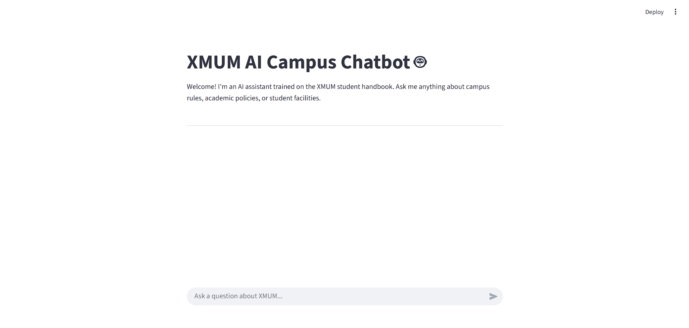

# A Retreival-Augmented Generation (RAG) Chatbot

An intelligent chatbot designed to answer questions about the Xiamen University Malaysia (XMUM) information and policy. This project leverages a Retrieval-Augmented Generation (RAG) pipeline to provide accurate, context-aware answers from a local knowledge base.



## Table of Contents
- [The Problem](#the-problem)
- [The Solution](#the-solution)
- [Key Features & Technical Stack](#key-features--technical-stack)
- [The Evaluation Journey](#the-evaluation-journey)
  - [Run 1: Baseline Performance](#run-1-baseline-performance)
  - [Run 2: Advanced Chunking](#run-2-advanced-chunking)
  - [Run 3: Final Optimized Pipeline](#run-3-final-optimized-pipeline)
- [System Architecture](#system-architecture)

## The Problem

Students often have specific questions about university policies, academic rules, and application procedures. However, this critical information is typically scattered across a multitude of documents, such as student handbooks, academic calendars, fee structures, and policy PDFs. Finding a precise answer requires navigating this disorganized collection of files, where a simple keyword search is often insufficient for complex or nuanced queries. This project aims to solve that problem by creating a centralized, intelligent interface that can understand and answer questions using this entire collection of documents as its single source of truth.

## The Solution

A Retrieval-Augmented Generation (RAG) pipeline was chosen as the ideal architecture. This approach grounds the Large Language Model (LLM) in a specific set of documents, preventing hallucinations and ensuring that the answers are factual and based solely on the provided context.

The system works as follows:
1.  **Ingestion:** Documents (PDFs, DOCX, TXT) are loaded, and text is extracted using a hybrid OCR/direct-extraction method for maximum efficiency.
2.  **Chunking & Embedding:** The text is segmented into small, metadata-enriched chunks and converted into vector embeddings using `all-MiniLM-L6-v2`.
3.  **Storage:** These embeddings are stored in a ChromaDB vector database for fast semantic search.
4.  **Retrieval & Re-ranking:** When a user asks a question, the system first retrieves a broad set of 20 potentially relevant chunks  and then uses a Cross-Encoder model to re-rank them for precision.
5.  **Generation:** The top 3 most relevant chunks are fed as context to a Llama3-8B model via the Groq API, which generates a final, concise answer.

## Key Features & Technical Stack

- **Backend API:** FastAPI - Manages embeddings, reranking, and response generation. Returns final chatbot answer via /ask endpoint.
- **Frontend UI:** Streamlit - Provides chatbot UI. Sends query → gets response from FastAPI.
- **LLM:** Llama3-8B - Includes rate limit handling with tenacity retry logic + exponential backoff.
- **Vector Database:** ChromaDB
- **Embedding Model:** `all-MiniLM-L6-v2`
- **Re-ranking Model:** `cross-encoder/ms-marco-MiniLM-L-6-v2`
- **Evaluation Framework:** Ragas (`faithfulness`, `answer_relevancy`, `context_recall`, `context_precision`) - Uses ChatGroq (Llama3) as the evaluation judge.
- **Document Processing:** PyMuPDF, python-docx, Pytesseract (for OCR)

## The Evaluation Journey

A key focus of this project was using quantitative data to drive improvements. The Ragas framework was used to evaluate the pipeline after each major change, focusing on Context Recall (finding the right info) and Context Precision (ignoring the wrong info).

### Run 1: Baseline Performance

- **Strategy:** The pipeline featured a two-stage retrieval process: a fast vector search followed by CrossEncoder re-ranker. However, a naive chunking strategy is used (chunk_size=1000).
- **Result:** **Poor Context Recall (0.61) and Context Precision (0.556)**. The system frequently failed to find the necessary information, even if it was present in the documents.

### Run 2: Advanced Chunking

- **Hypothesis:** Smaller, more contextually-aware chunks would fix the retrieval failures.
- **Strategy:** Reduced `chunk_size` to 500 and enriched each chunk with source document metadata.
- **Result:** **Excellent Context Recall (0.711)**, but **poor Context Precision (0.561)**. The system found the right information but also retrieved a lot of irrelevant "noise."

### Run 3: Final Optimized Pipeline

- **Hypothesis:** The re-ranker could filter out the noise if it had more options to choose from.
- **Strategy:** Increased the initial retrieval net by increasing the candidate pool from 10 to 20 documents, giving the Cross-Encoder more to analyze and discard.
- **Result:** **Balanced Performance**. Maintained high **Context Recall (0.711)** while significantly improving **Context Precision (0.744)**, resulting in the best-performing version of the pipeline.

## System Architecture

The application is designed with a decoupled frontend and backend. The user interacts with the Streamlit UI, which sends requests to the FastAPI API. The API then processes the query through the full RAG pipeline to generate and return an answer.

```mermaid
flowchart TD
    A[Documents: PDF/DOCX/TXT] -->|Extraction & OCR| B[Preprocessing & Chunking]
    B --> C[Embeddings: MiniLM]
    C --> D[ChromaDB Vector Store]

    subgraph Retrieval
        E[User Query] --> F[Query Embedding]
        F --> G[ChromaDB Search (Top 20)]
        G --> H[Cross-Encoder Reranking]
        H --> I[Top 3 Chunks]
    end

    I --> J[Groq Llama3 LLM]
    E --> J
    J --> K[Final Answer]

    subgraph Evaluation
        L[Eval Dataset] --> M[RAGAS Evaluation]
        K --> M
        I --> M
    end

    K --> N[FastAPI Backend]
    N --> O[Streamlit Chat UI]


    